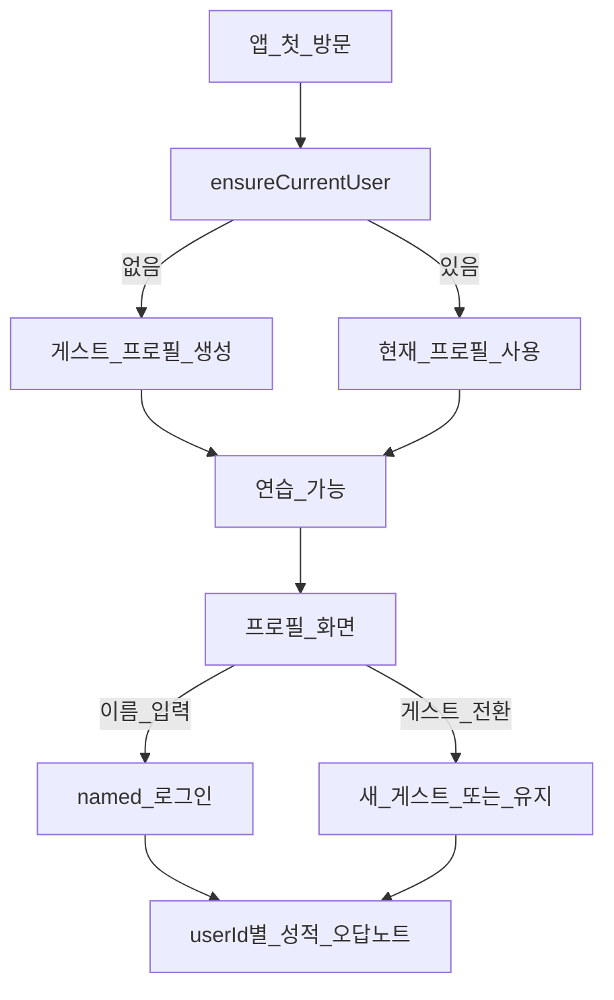

# 간단 로그인 · 게스트 ID 설계

> 관련 구현: `lib/auth.ts`, `components/AuthProvider.tsx`, `app/profile/page.tsx`  
> 저장: 브라우저 `localStorage` (서버 계정 없음)

---

## 1. 목표

초등학생이 **비밀번호 없이** 빠르게 구분될 수 있게 한다.

- 첫 방문: **게스트 ID** 자동 발급 → 바로 연습
- 선택: **이름(닉네임) 로그인** → 같은 기기에서 성적·오답 노트 이어보기
- 서버/회원가입/이메일 없음 (Phase 3 로컬 단계)

---

## 2. 사용자 모델

```ts
type UserMode = "guest" | "named";

interface UserProfile {
  id: string;          // guest-xxxxxxxx | named-xxxxxxxx
  displayName: string; // "게스트" 또는 입력 이름 (1~12자)
  mode: UserMode;
  createdAt: number;
  lastSeenAt: number;
}
```

| 모드 | ID 예 | 표시 이름 | 특징 |
|------|--------|-----------|------|
| guest | `guest-a1b2c3d4` | 게스트 | 첫 방문 자동 생성, 기록은 해당 ID 스코프 |
| named | `named-e5f6g7h8` | 민수 등 | 이름만으로 로그인, 같은 이름이면 기존 프로필 재사용 |

---

## 3. 흐름



1. `AuthProvider` 마운트 시 `ensureCurrentUser()` + 레거시 데이터 마이그레이션
2. 헤더에 현재 이름 표시 → `/profile`
3. 이름으로 시작 / 최근 이름 선택 / 게스트 전환

---

## 4. 저장 키

| 키 | 내용 |
|----|------|
| `math-kids:current-user` | 현재 `UserProfile` |
| `math-kids:users` | 이 기기에 쓴 프로필 목록 |
| `math-kids:{userId}:scores` | 성적 |
| `math-kids:{userId}:wrong-notes` | 오답 노트 |
| `math-kids:{userId}:last-session` | 최근 세션 |
| `math-kids:migrated-v1` | 구(글로벌) 키 → 첫 사용자 스코프 이전 완료 플래그 |

프로필을 바꾸면 **다른 userId 저장소**를 읽으므로 성적·오답이 분리된다.

---

## 5. 보안·프라이버시 (의도적 한계)

- 비밀번호·서버 검증 없음 → **가족 공용 PC에서 이름만으로 전환 가능**
- 데이터는 해당 브라우저에만 존재 (로그아웃해도 목록에 named 프로필 남음)
- 클라우드 동기화·복구는 Phase 이후 과제

초등 연습 앱의 “누구인지 구분” 목적에는 충분하고, 학교 계정 SSO 등은 범위 밖이다.

---

## 6. UI

- **헤더**: 아바타 이니셜 + 이름 → 프로필
- **`/profile`**: 현재 ID, 이름 로그인 폼, 최근 이름, 게스트 전환, 연습하기 CTA

---

## 7. 이후 확장

1. 진도·약한 유형 대시보드 (userId 기준 집계)
2. (선택) PIN 4자리로 named 프로필 보호
3. (선택) 서버 계정 연동 시 동일 `UserProfile`을 원격 ID에 매핑
