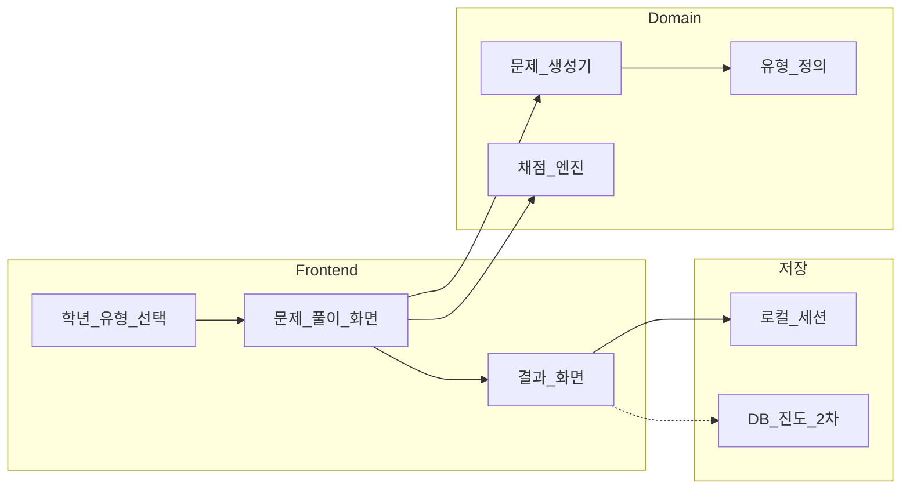

# 초등 수학 문제 풀이 프로젝트 작업계획서

> 프로젝트명: **수학탐험**  
> 문서 버전: 1.0  
> 작성일: 2026-09-07  
> 상태: Phase 1(MVP) · Phase 2 · Phase 3(계정·유형·대시보드) 구현 완료 / 선택 기능 예정

---

## 1. 프로젝트 목표

초등학생이 **학년·단원별로 수학 문제를 풀고**, 즉시 정오 확인과 간단한 해설을 받으며, 풀이 기록을 쌓을 수 있는 웹 앱을 만든다.

### MVP 성공 기준

- [x] 학년(1~6) · 연산 유형 선택 후 문제 풀이 가능
- [x] 제출 즉시 채점 및 정답/오답 표시
- [x] 세션별 점수·정답률 확인
- [x] PC·모바일 브라우저에서 사용 가능

---

## 2. 가정(기본 방향)

| 항목 | 결정 |
|------|------|
| 형태 | 웹 앱 (반응형) |
| 스택 | Next.js + TypeScript + Tailwind CSS |
| 문제 출처 | 규칙 기반 문제 생성기 (난수 파라미터) |
| 사용자 | 1차: 비로그인 로컬 세션 / 2차(Phase 3): 간단 계정·진도 저장 |
| 학년 범위 | 초등 1~6학년, MVP는 **사칙연산·분수·소수 기초** 우선 |
| 언어 | UI·문제 한국어 |

---

## 3. 대상 사용자 · 핵심 가치

- **초등학생**: 큰 글씨, 단순 UI, 터치 친화 입력, 즉각 피드백
- **학부모/교사(Phase 3)**: 풀이 기록·약한 유형 요약

**핵심 가치:** “풀기 → 바로 알기 → 다시 연습하기” 루프를 방해 없이 유지

---

## 4. 기능 범위

### Phase 1 — MVP (필수) ✅

1. 학년 / 단원(유형) 선택
2. 문제 출제 (N문제 세트)
3. 답 입력 · 제출 · 즉시 채점
4. 맞으면 칭찬 / 틀리면 정답·짧은 해설
5. 세트 종료 시 점수·정답률 요약
6. 다시 풀기

### Phase 2 — 학습 강화 ✅

- 오답 노트(틀린 문제 재도전)
- 난이도(쉬움/보통/어려움)
- 타이머·제한 시간 모드
- 로컬 스토리지로 최근 성적 보존

### Phase 3 — 계정·확장 ✅

- [x] 간단 로그인(또는 게스트 ID) — [인증설계.md](./인증설계.md)
- [x] 진도·약한 유형 대시보드 (`/dashboard`)
- [x] 문제 유형 확장(도형, 단위 환산, 문장제)
- (선택) 음성 읽기, 접근성 강화

### 제외(초기)

- AI 자유 채팅 풀이, SNS, 결제, 복잡한 LMS

---

## 5. 시스템 구조



### 디렉터리 구조

| 경로 | 역할 |
|------|------|
| `app/` | 페이지 (홈, 풀이, 결과, 오답노트, 성적) |
| `lib/problems/` | 유형별 생성·채점 로직 |
| `lib/curriculum/` | 학년·단원 메타데이터 |
| `lib/storage.ts` | 로컬 스토리지 (성적·오답노트) |
| `components/` | UI 컴포넌트 (키패드, 진행 바 등) |
| `types/` | Problem, Attempt, Session 타입 |

---

## 6. 문제·커리큘럼 설계

### 구현된 유형

| 유형 ID | 이름 | 대상 학년 |
|---------|------|-----------|
| `addition` | 덧셈 | 1~3 |
| `subtraction` | 뺄셈 | 1~3 |
| `multiplication` | 곱셈 | 2~4 |
| `division` | 나눗셈 | 3~4 |
| `fraction-add` | 분수 덧셈(동분모) | 5~6 |
| `fraction-sub` | 분수 뺄셈(동분모) | 5~6 |
| `decimal-add` | 소수 덧셈 | 5~6 |
| `geometry` | 도형 (변·꼭짓점 / 둘레 / 넓이) | 1~6 |
| `unit-conversion` | 단위 환산 (길이·무게·들이) | 2~6 |
| `word-problem` | 문장제 | 1~6 |

### 채점 규칙

- 숫자/분수 정규화 후 비교 (공백, 전각 숫자, 약분 동치)
- 부분 점수 없음 — 정/오만
- 해설은 생성 시점에 숫자와 함께 템플릿으로 구성

---

## 7. UI/UX 원칙 (초등 특화)

- 한 화면에 **한 가지 일**(문제 또는 결과)
- 큰 터치 영역, 숫자 키패드(모바일)
- 강한 색 대비, 장식보다 가독성
- 오답 시 비난 톤 금지, 짧은 격려 문구
- 애니메이션은 정답 피드백 등 소수만 의도적으로 사용

---

## 8. 단계별 일정

| 단계 | 기간(가안) | 산출물 | 상태 |
|------|------------|--------|------|
| 0. 킥오프 | 0.5일 | 요구사항·가정 확정, 레포 초기화 | ✅ |
| 1. 기반 | 1~2일 | Next.js 세팅, 레이아웃, 홈 | ✅ |
| 2. 문제 엔진 | 2~3일 | 유형 생성기 + 채점 + 단위 테스트 | ✅ |
| 3. 풀이 UX | 2일 | 문제 화면, 입력, 피드백, 세트 진행 | ✅ |
| 4. 결과·재도전 | 1일 | 점수 요약, 다시 풀기 | ✅ |
| 5. 다듬기 | 1~2일 | 모바일·접근성·카피 | ✅ |
| 6. Phase 2 | — | 오답노트, 로컬 기록, 난이도·타이머 | ✅ |
| 7. Phase 3 | 이후 | 계정·대시보드·유형 확장 | ⏳ |

---

## 9. 검증·테스트 계획

| 항목 | 방법 | 상태 |
|------|------|------|
| 유형별 생성기 | `npm test` (Vitest) — 범위·정답 일치 | ✅ |
| 빌드 | `npm run build` | ✅ |
| 수동 QA | 학년별 샘플, 모바일 가로/세로 | 권장 지속 |
| 사용성 | 초등 저학년 기준 “도움 없이 한 세트 완료” | 권장 지속 |

---

## 10. 리스크와 대응

| 리스크 | 대응 |
|--------|------|
| 문장제·도형은 렌더링 복잡 | MVP는 연산 중심, 도형은 Phase 3 |
| 분수 입력 UX 어려움 | 분자/분모 분리 입력 UI |
| 범위가 커짐 | 유형 화이트리스트로 MVP 고정 |
| 동기부여 부족 | 연속 정답 스트릭·별점 |

---

## 11. 구현 체크리스트

- [x] 레포 초기화 + Next.js/TS/Tailwind
- [x] 학년·유형 메타데이터 스키마 정의
- [x] 덧셈/뺄셈/곱셈 등 생성기 + 채점
- [x] 홈 → 풀이 → 결과 플로우 연결
- [x] 모바일 키패드·피드백
- [x] 오답 노트 · 성적 로컬 저장
- [x] 도형 / 단위 환산 / 문장제 유형 추가
- [x] 간단 로그인 · 게스트 ID
- [x] 진도·약한 유형 대시보드
- [ ] (선택) 음성 읽기·접근성 강화 · PIN · 클라우드 동기화

---

## 12. 실행 방법

```bash
npm install
npm run dev      # http://localhost:3000
npm test         # 단위 테스트
npm run build    # 프로덕션 빌드
```

관련 문서:
- [README.md](../README.md)
- [인증설계.md](./인증설계.md) — 게스트 ID · 이름 로그인

---

## 13. 다음 액션 (선택)

1. (선택) 문제 음성 읽기·접근성 강화
2. (선택) named 프로필 PIN 보호 · 클라우드 동기화
